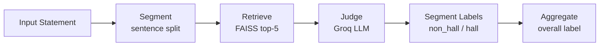

# Hallucination Detection — FELM-Style for Vietnamese History

Part of **Project 02: Hallucination Detection & Mitigation** (flagship project).

---

## Architecture



**Pipeline steps:**
1. **Segment** — split Vietnamese text on `.?!;` boundaries
2. **Retrieve** — embed with `paraphrase-multilingual-MiniLM-L12-v2`, query FAISS index built from OCR'd history textbook (272 chunks, ~500 chars each)
3. **Judge** — Groq `llama-3.3-70b-versatile` with FELM taxonomy few-shot prompt
4. **Aggregate** — `hallucinated` if any segment is hallucinated

---

## FELM Taxonomy

| Label | Error Type | Description |
|---|---|---|
| `non_hallucinated` | `none` | Factually supported by retrieved evidence |
| `hallucinated` | `entity_error` | Wrong name, place, organization, or number |
| `hallucinated` | `temporal_error` | Wrong date, year, or event sequence |
| `hallucinated` | `factuality_contradiction` | Contradicts established historical fact |

---

## How to Run

```bash
# 1. Setup venv
cd 02-hallucination/detection
uv venv --python 3.10
uv pip install -r requirements.txt

# 2. Build FAISS index
python build_index.py

# 3. Run evaluation (100-sample benchmark)
python evaluate.py
```

Requires `GROQ_API_KEY` in `.env`.

---

## Results (100-sample subset, `random_state=42`)

### Segment-Level

| Class | Precision | Recall | F1 |
|---|---|---|---|
| non_hallucinated | 0.576 | 0.636 | 0.604 |
| hallucinated | 0.581 | 0.519 | 0.548 |
| macro avg | 0.578 | 0.577 | 0.576 |

### Statement-Level

| Metric | Score |
|---|---|
| Accuracy | 0.620 |

### Ablation: RAG vs No-RAG

| Metric | With RAG | No RAG |
|---|---|---|
| Hallucinated Precision | 0.581 | 0.541 |
| Hallucinated Recall | 0.519 | 0.769 |
| Hallucinated F1 | 0.548 | 0.635 |
| Statement Accuracy | 0.620 | 0.620 |

> **Observation:** No-RAG achieves higher hallucinated recall (more aggressive flagging)
> but at cost of precision — false positive rate is much higher. RAG retrieval
> improves precision (+4 pp) while keeping statement-level accuracy equal.
> The no-RAG model over-predicts `factuality_contradiction` (121 vs 56 with RAG).

### Error Type Distribution (predicted hallucinations, with RAG)

| Error Type | Count |
|---|---|
| factuality_contradiction | 56 |
| entity_error | 32 |
| temporal_error | 5 |

---

## Scope & Limitations

**What was done:**
- FAISS retrieval over OCR'd Vietnamese history textbook (99k chars, 272 chunks)
- Groq-hosted LLM judge with FELM taxonomy + few-shot prompt
- Segment-level and statement-level evaluation on 100 annotated samples
- Ablation comparing RAG vs no-RAG retrieval

**Known limitations:**
1. **Corpus coverage gap** — retrieval corpus is a single textbook; questions in `felm_vi_history.csv` may reference events not covered, causing retrieval to return tangentially relevant passages.
2. **No NLI model** — original FELM uses dedicated NLI; here a prompted LLM does classification, which is noisier.
3. **F1 ~0.55–0.60** — baseline-level; would improve with larger/better-matched corpus and BM25 hybrid retrieval.
4. **Embedding model** — `paraphrase-multilingual-MiniLM-L12-v2` (not `bge-m3`) used for speed; bge-m3 would likely improve recall for Vietnamese.
5. **No fine-tuning** — the judge is zero/few-shot only. A fine-tuned verifier on Vietnamese history would substantially improve.
6. **Rate-limited evaluation** — 0.8s sleep between Groq calls; results cache-saved for reproducibility.
