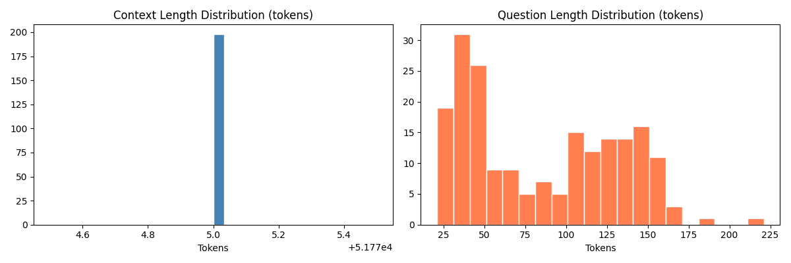

## Dataset Overview

| Field | Value |
|-------|-------|
| Samples | 198 |
| Columns | Unnamed: 0, id, question, context, type |

> **Note:** Column `type` has values `"TRUE"`/`"FALSE"` with unclear semantic
> (possibly indicates question difficulty or source). It is **ignored** in data
> generation — all rows are treated uniformly.

## Context Length Distribution (tokens)

| Stat | Value |
|------|-------|
| Min | 51775 |
| Max | 51775 |
| Mean | 51775 |
| Median | 51775 |
| p95 | 51775 |

## Question Length Distribution (tokens)

| Stat | Value |
|------|-------|
| Min | 21 |
| Max | 221 |
| Mean | 85 |
| Median | 80 |
| p95 | 154 |

## Sample Examples (3 random rows, truncated)

- **id=THPT10_22_3** | `Sự phát triển của làng thủ công Việt Nam thế kỉ XVI - XVIII có ý nghĩa tích cực ...` | ctx=51775 tokens
- **id=THPT10_14_8A** | ` Như chúng ta đều biết, cư dân Cham-pa đã đạt tới trình độ cao trong việc xây dự...` | ctx=51775 tokens
- **id=THPT10_14_9** | `Hãy nêu những nét chính về tình hình kinh tế, văn hoá, xã hội của quốc gia Phù N...` | ctx=51775 tokens

## Train / Test Split (question-level, no leakage)

| Split | Questions | Expected pairs (grounded ×3 + premise + distractor) |
|-------|-----------|------------------------------------------------------|
| Train | 158 | ~548 |
| Test  | 40 | ~138 |

Split seed: 42. Saved to `question_splits.json`.
